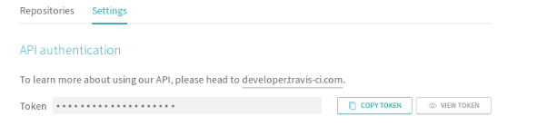

# How to configure ci-bot

This document helps to configure ci-bot 

## Prerequisites to configure the ci-bot 

- [Create github token of your account](#Create-github-token)
- [Webhook setup for your repository](#WebHook-Setup)
- [Travis Token](#Travis-token)

### Create github token

  Reference link to generate [Github Token](https://help.github.com/en/articles/creating-a-personal-access-token-for-the-command-line)
 
### WebHook Setup

  Reference link to setup [WebHooks](https://developer.github.com/webhooks/creating/) 
    
     
    
### Travis token

   Reference to get the [Travis-CI-Token](https://travis-ci.org)	
   - Login into Travis CI(Using github account)
   - Go to account Settings
   - Copy Token    

    

### Steps to setup ci-bot
   
- Clone [ci-bot](https://github.com/Huawei-PaaS/ci-bot)  

```
   $ mkdir -p $GOPATH/src/github.com/Huawei-PaaS
   $ cd $GOPATH/src/github.com/Huawei-PaaS
   $ git clone https://github.com/Huawei-PaaS/ci-bot
   $ cd ci-bot
   $ make  

```
### Usage
- ci-bot requires following flags to run the binary

```
   Usage of ./ci-bot:
        
         --github-token string      Contains the githubtoken info
         --repo string              Refers to the project repo address
         --repoName string          Contains repo name of CI build Ex: kubeedge/kubeedge
         --travis-ci-token string   Contains Travis-CI access token to trigger the PR build
         --webhook-secret string    Contains the webhooksecret key
```
- start the ci-bot binary with the above flags

`./ci-bot --repo=<repository name>  --github-token=<github-token> --travis-ci-token=<travis-ci-token> --webhook-secret=<webhook-secret>`


## Events supported by ci-bot  
    
#### Add/Remove specific user to an Issue/PullRequest
```
/assign @nameofassignee - [/assign is used to add a specific user to an Issue/PullRequest]
/unassign @nameofassignee - [/unassign is used to remove a specific user from an Issue/PullRequest]
```
#### Add/Remove Label 

Add/Remove label is used to add/remove certain types of labels to the Issues/PullRequests in the comment/Describe section

```
label options are: 

    /kind
    /priority 
    /remove-kind
    /remove-priority
   
   example: /kind test, /priority test, /remove-kind test
```
- Labels in Describe Section
```
Sample PR description for reference

What type of PR is this?
/kind design

What this PR does / why we need it:
***

Which issue(s) this PR fixes:
***

Special notes for your reviewer:
***
```
#### Add Label from PullRequest Describe section

Add label is used to add certain types of labels to the Issues/PullRequests in the Describe section
```
Sample PR description for reference

What type of PR is this?
/kind design

What this PR does / why we need it:
***

Which issue(s) this PR fixes:
***

Special notes for your reviewer:
***
```
#### Retest 
retest is used to retest the PullRequest build

```
 /retest
     
```
#### Test
test is used to test the job

```
 /test jobname

example: /test build
```
